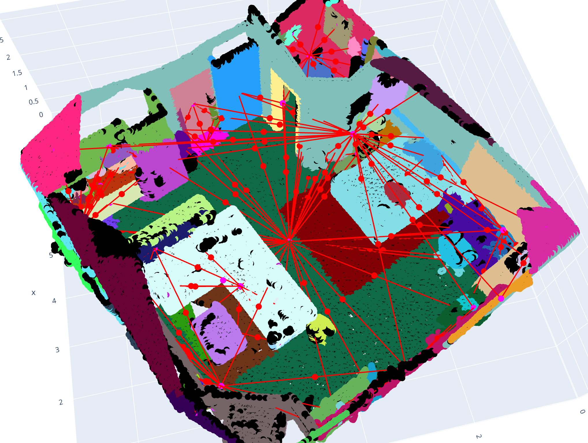

# 3dscenegraph_demo:
This is a demo for to showcase the method for generating 3D scene graphs as described in my thesis project "Software pipeline for 3D Scene Graphs".

At this point I want to thank my advisors Dr. Dániel Béla Baráth and Prof. Dr. Marc Pollefeys!



# Setup and dependencies (tested on Ubuntu 22.04):
1. Clone the repository.

2. Create a venv (python 3.10.12, pip 25.1.1) to install following dependencies in. Was tested on [lighting.ai](https://lightning.ai) server with NVIDIA T4 GPU. 
```bash
python -m venv .venv
```
3. Run following commands to install basic dependencies.
```bash
pip install torch==2.2.0+cu121 torchvision==0.17.0+cu121 torchaudio==2.2.0 --index-url https://download.pytorch.org/whl/cu121
pip install trimesh==4.6.4
pip install plotly==6.0.0
pip install pandas==2.2.3
pip install plyfile==1.1
pip install open3d==0.19.0
pip install seaborn==0.13.2
```
5. Run through mask2former installation by stepping through mask2former_install_help.ipynb notebook. This can be a bit tricky without a nvidia gpu, please help yourself to other sources on installation issues. Sometimes need to run "git clone https:/github.com/facebookresearch/Mask2Former.git" in terminal manually before.

4. Download mask2former model (or different model of your choise from model Zoo).
```bash
wget -P model_weights/ https://dl.fbaipublicfiles.com/maskformer/mask2former/coco/panoptic/maskformer2_swin_large_IN21k_384_bs16_100ep/model_final_f07440.pkl
```

5. Unzip the example scan or self scanned (3D Scanner App) scan in scans/ folder.
```bash
unzip scans/Untitled_Scan_20_18_44.zip -d scans/
```

6. Run the main script.
```bash
python main.py --input scans/Untitled_Scan_20_18_44/ 
```

7. Check the html output file in 3dscenegraph_demo/output/2025_05_30_20_18_10/plot !